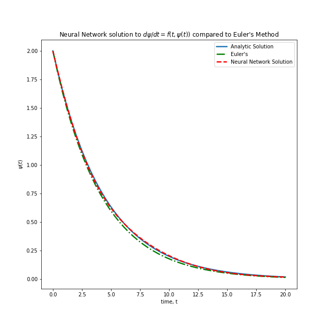
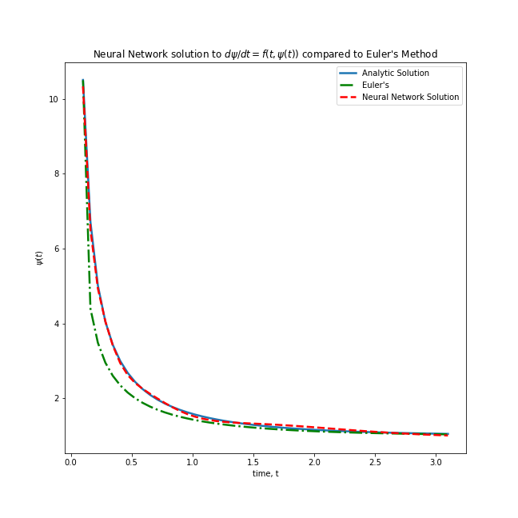
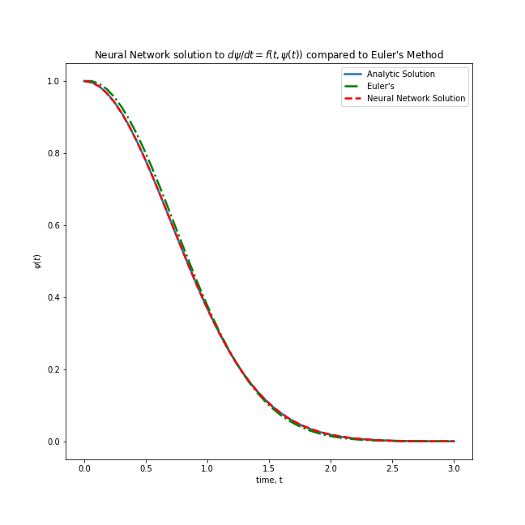
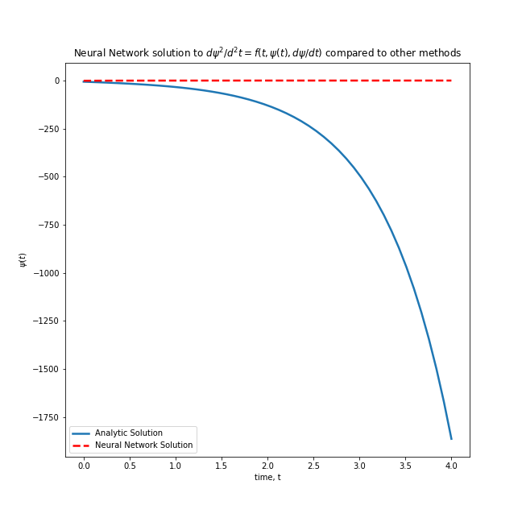
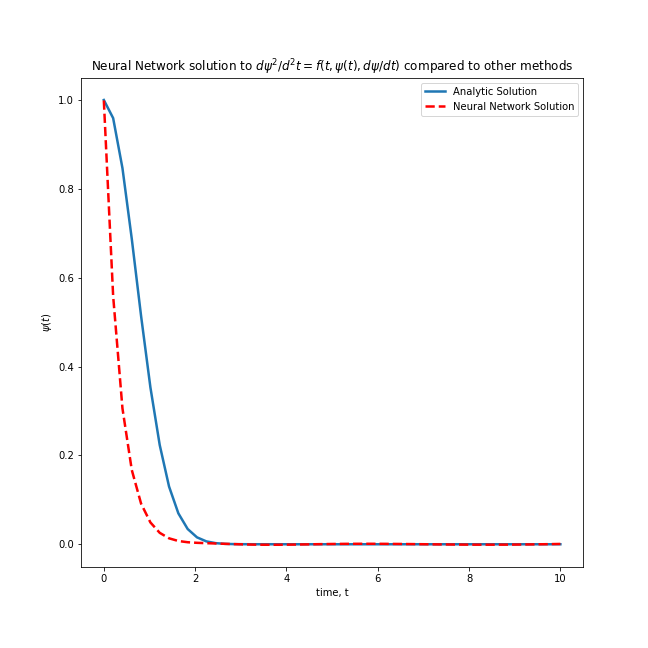

# Solving Differential Equations using Neural Networks

As part of an undergraduate research course, I spent a semester working briefly on solving First-Order Differential Equations (ODE's) using neural networks. We found that since neural networks are universal approximators, they were able to successfully mimic the analytical solution and with much lower error than Euler's method, and once trained, were computationally efficient.

Here are some results for 1st-order ODE's:

${df}/over{dt} = -0.23 * f(t)$

And results for 2nd-order ODE's:

